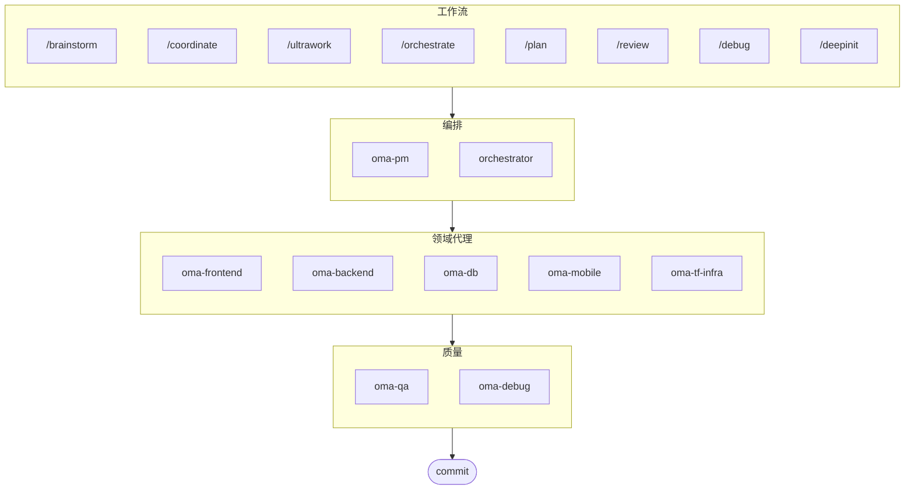

# oh-my-agent: 便携式多代理 Harness

    

[English](../README.md) | [한국어](./README.ko.md) | [Português](./README.pt.md) | [日本語](./README.ja.md) | [Français](./README.fr.md) | [Español](./README.es.md) | [Nederlands](./README.nl.md) | [Polski](./README.pl.md) | [Русский](./README.ru.md) | [Deutsch](./README.de.md)

专为严谨的 AI 辅助工程打造的便携式、基于角色的代理 Harness。

适用于所有主流 AI IDE，包括 Antigravity、Claude Code、Cursor、Gemini、OpenCode 等。它将基于角色的代理、显式工作流、实时可观测性和标准化指导融为一体，帮助团队告别粗制滥造的 AI 代码，走向更有纪律的工程执行。

## 目录

- [这是什么？](#这是什么)
- [架构](#架构)
- [为何不同](#为何不同)
- [这是什么？](#这是什么)
- [快速开始](#快速开始)
- [赞助商](#赞助商)
- [许可证](#许可证)

## 架构

## 为何不同

- **`.agents/` 是权威来源**：技能、工作流、共享资源和配置都存放在一个可移植的项目结构中，而不是锁死在某个 IDE 插件里。
- **角色化代理团队**：PM、QA、DB、Infra、Frontend、Backend、Mobile、Debug 和 Workflow 代理按工程组织的模式建模，而不只是一堆提示词。
- **工作流优先的编排**：规划、审查、调试和协调执行都是一等公民的工作流，而非事后补丁。
- **内建标准意识**：代理携带针对 ISO 驱动规划、QA、数据库连续性/安全及基础设施治理的专项指导。
- **为验证而设计**：仪表盘、清单生成、共享执行协议和结构化输出以可追溯性为先，而不是凭感觉生成。

## 这是什么？

一套 **Agent 技能**集合，支持协作式多代理开发。工作按明确的角色、工作流和验证边界分配给各专业代理：

| 代理 | 专业领域 | 触发条件 |
|------|---------|---------|
| **Brainstorm** | 规划前的设计优先构思 | "brainstorm", "ideate", "explore idea" |
| **PM Agent** | 需求分析、任务分解、架构设计 | "plan", "break down", "what should we build" |
| **Frontend Agent** | React/Next.js、TypeScript、Tailwind CSS | "UI", "component", "styling" |
| **Backend Agent** | Backend (Python, Node.js, Rust, ...) | "API", "database", "authentication" |
| **DB Agent** | SQL/NoSQL 建模、规范化、完整性、备份、容量规划 | "ERD", "schema", "database design", "index tuning" |
| **Mobile Agent** | Flutter 跨平台开发 | "mobile app", "iOS/Android" |
| **QA Agent** | OWASP Top 10 安全、性能、可访问性 | "review security", "audit", "check performance" |
| **Debug Agent** | Bug 诊断、根因分析、回归测试 | "bug", "error", "crash" |
| **Developer Workflow** | 单仓库任务自动化、mise 任务、CI/CD、迁移、发布 | "dev workflow", "mise tasks", "CI/CD pipeline" |
| **TF Infra Agent** | 多云 IaC 基础设施配置（AWS、GCP、Azure、OCI） | "infrastructure", "terraform", "cloud setup" |
| **Orchestrator** | 基于 CLI 的并行代理执行，使用  | "spawn agent", "parallel execution" |
| **Commit** | 遵循项目特定规则的 Conventional Commits | "commit", "save changes" |

## 架构

## 为何不同

- **`.agents/` 是权威来源**：技能、工作流、共享资源和配置都存放在一个可移植的项目结构中，而不是锁死在某个 IDE 插件里。
- **角色化代理团队**：PM、QA、DB、Infra、Frontend、Backend、Mobile、Debug 和 Workflow 代理按工程组织的模式建模，而不只是一堆提示词。
- **工作流优先的编排**：规划、审查、调试和协调执行都是一等公民的工作流，而非事后补丁。
- **内建标准意识**：代理携带针对 ISO 驱动规划、QA、数据库连续性/安全及基础设施治理的专项指导。
- **为验证而设计**：仪表盘、清单生成、共享执行协议和结构化输出以可追溯性为先，而不是凭感觉生成。

